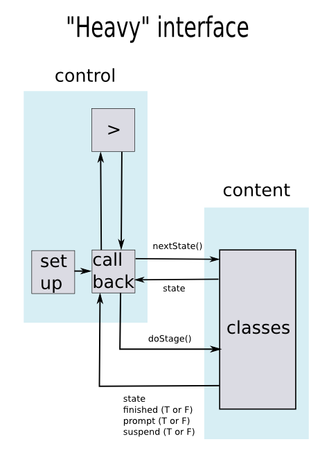

## heavy.R and nickTestS3.R: sequencing logic relegated to states 

Sequencing logic is relegated to individual units of instruction, represented as "states" which belong to various S3 classes. States return instructions to the controlling callback. Instructions depend on a state's class and user behavior.

Control and units of instruction ("content") communicate via two methods, nextState(state) and doStage(state, expr, val), which must be available for each class and conform to fixed conventions. In particular, `nextState(state)` must return the next state, if available, or `NULL` if not, and `doStage(state, expr, val)` must return a list of 3 logical values, finished, prompt, and suspend, along with the current state. The logical value, finished, indicates whether the state has been successfully completed. The value, prompt, indicates whether control should be returned to the prompt. The value, suspend, indicates that the user wants a break in instruction in order to experiment.

"Heavy.R" contains all "control" code. It also contains "content" code for Module 2 of Data Analysis. Eight classes are implmented, corresponding to various output types and answer types of swirl 1.0. Source the file and type hiHeavy() to run.

"NickTestS3.R" re-implements nickTest.R according to the conventions described above. The point is to stress the interface, i.e., to test whether the same behavior can be obtained just by adding content code without changing control code. NickTestS3.R uses precisely the same callback as does heavy.R. Two content classes, "nickNoTestState," and "nickTestState" are implemented. Source the file and type hiNickTest() to run.

Files frndly.R, demo.R, and the original nickTest.R are included for reference. 

